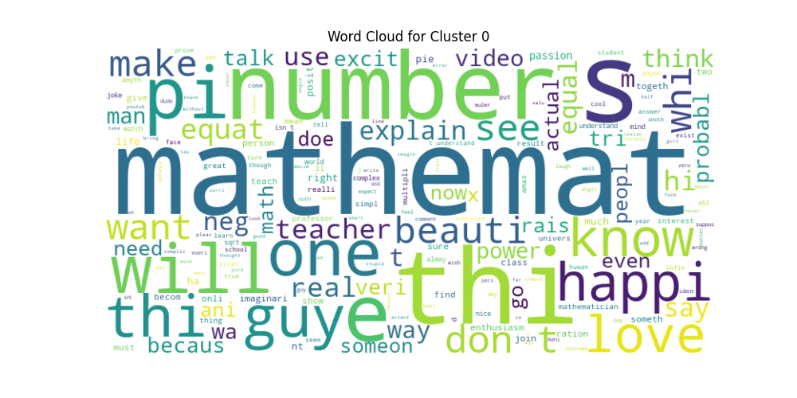
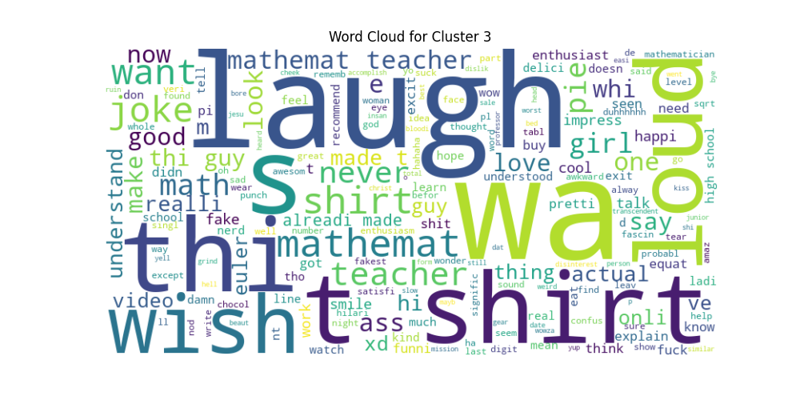
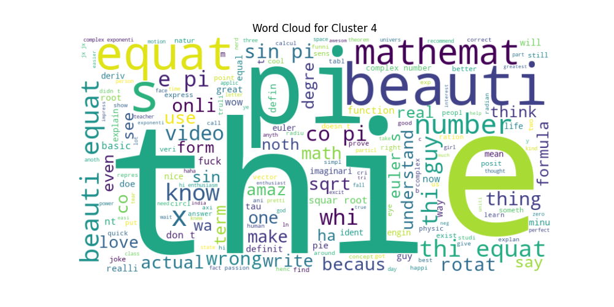
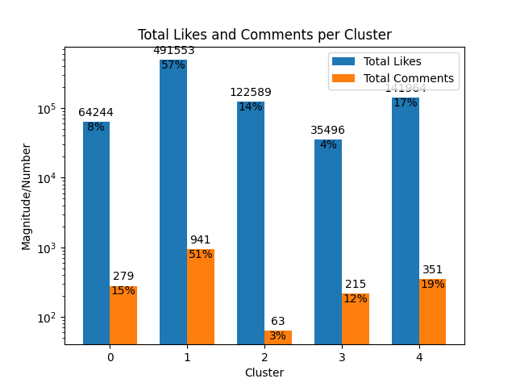

> [!NOTE]
> **Python3.9** or above is required to make use of this project.

## Prerequisites
Before we move onto clustering YouTube comments, we would first need to fetch its comments. 

Google thankfully provides us with the [YouTube Data API](https://developers.google.com/youtube/v3), which could be used for a multitude of purposes.
However our need for this project is just limited to fetching comments from a specific YouTube video, along with their respective like counts.

#### Setting up the API key
1. Follow the steps as described [here](https://support.google.com/googleapi/answer/6158862?hl=en) to set up a new API key. 

2. Navigate to the following path within the project, and create a file `API_KEY.py`. 

    ```bash
    ~\YT-Comments-Clustering\src\comments-extractor\API_KEY.py
    ```

3. Now, in this file, create a variable named `API_KEY` and assign the API key obtained from step 1 to this variable as a string.

    ```python
    API_KEY = "your_api_key_here"
    ```

And you're done with the API key setup!

<hr>
<br>

## Installing requirements

It's preferable to use this project in a separate virtual environment of its own, by virtue of the nature of the dependendence of certain modules on some certain specific versions of other modules that are used in this project.

#### Creating a virtual environment

> [!NOTE]
> Use `pip3` and `python3` if on a Mac or Linux machine, otherwise the usual `python` on Windows.

1. Navigate to the project root `~\YT-Comments-Clustering` and execute:
    ```bash
    python -m venv project-venv
    ```
2. To activate this venv:

    ```bash
    source project-venv/bin/activate
    ``` 
    > Mac/Linux

    or,

    ```bash
    project-venv\Scripts\activate
    ``` 
    > Windows

3. When done with using the project, deactivate the venv:
    ```bash
    deactivate
    ```
<br>

> [!IMPORTANT]
> Now all our requirements will be installed within this venv, namely `project-venv`. Make sure to activate this venv whenever you wish to make use of this project.

<br>

#### Installing dependencies

```bash
pip install -r requirements.txt
```
```bash
python
>>> import nltk
>>> nltk.download('stopwords')
```
```bash
python -m spacy download en_core_web_sm
```

And you are done with the requirements' setup!
The project's now ready to use!

<hr>
<br>

### Usage

Let us now cluster the comments made on [this video](https://www.youtube.com/watch?v=IUTGFQpKaPU), going through each of the steps involved in the project's usage.

> [!NOTE]
> Before executing the shown commands, make sure to be in the project's root directory i.e. `~\YT-Comments-Clustering\`. Operate your command line or terminal from this path.

#### Comments Extraction


The video ID will be located in the URL of the video page, right after the `v=` URL parameter


For this video, it is `IUTGFQpKaPU`.

Run 
```bash
python src/comments-extractor/yt-comments-extractor.py -h
```

`yt-comments-extractor.py` is indeed a command line tool. 
```bash
usage: yt-comments-extractor.py [-h] VIDEO_ID JSON_PATH

Command Line Utility to extract and save YouTube comments of a specified video to a json file

positional arguments:
  VIDEO_ID    a YouTube video's ID
  JSON_PATH   relative path of json file to save the data

options:
  -h, --help  show this help message and exit
```

To fetch the comments made on the shown video, run:

```bash
python src/comments-extractor/yt-comments-extractor.py IUTGFQpKaPU raw-data/comments_1.json
```

It should take a while until the program finishes exectution with the message 
```
Comments Data saved successfully.
```

Now navigate to the earlier specified JSON file path, and you should be able to see the JSON file containing all the comments made on the video, along with their respective like counts.

> [!NOTE]
> The fetched comments don't include the replies made on the comments of the video, and thus as a consequence the total number of comments fetched maybe less than the actual comments made on a video.

<hr>

#### Comments Clustering
Now we shall move on with clustering the comments that have been fetched. 

Run
```bash
python src/main.py -h
```

`main.py`, alike `yt-comments-extractor.py`, is also a command line tool.

```bash
usage: main.py [-h] JSON_PATH CSV_PATH

Command Line Utility to cluster (pre-saved) YouTube comments and visualise the results

positional arguments:
  JSON_PATH   relative path of json file to be processed
  CSV_PATH    relative path of csv file to save the processed data

options:
  -h, --help  show this help message and exit
```

Run
```bash
python src/main.py raw-data/comments_1.json data/comments_1.csv
```

You'll be sequentially displayed the following lines of output
```bash
Reading data... Data read successfully

Cleaning data... Data cleaned successfully (28.06)s

Extracting features from cleaned data... Feature extraction performed successfully

Clustering datapoints... Datapoints clustered successfully

Writing data to data/comments_1.csv... Data written to csv successfully

Task complete (34.54s)


Press Enter to view the visual results 
```

Upon pressing enter, as many word-clouds shall be displayed (one-by-one) on your screen as there would be the number of clusters generated.
You can save these word-clouds in a folder.

- [ ] TODO: Auto-save the generated word-clouds and bar graph plot on the go.

 Each word-cloud would represent the frequency and relevance of the words that were the most used in the comments belonging to that cluster by means of their size.

 <div style="text-align: center;">
  <table style="margin: auto;">
    <tr>
      <td rowspan="2" align="center">
        
      </td>
      <td align="center">
        
      </td>
      <td align="center">
        
      </td>
    </tr>
    <tr>
      <td align="center">
        
      </td>
      <td align="center">
        
      </td>
    </tr>
  </table>
</div>

<br>

 After all the word-clouds, a bar graph plot shall also be displayed, comparing the number of comments and the total likes received to each of the clusters.




<br>

And Voila! You have now successfully clustered and analysed the comments on a video for the very first time by means of this project.